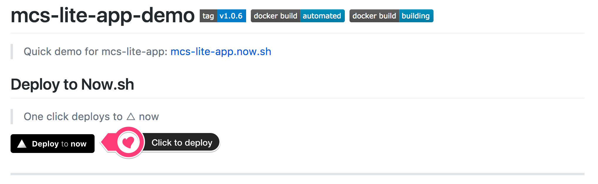
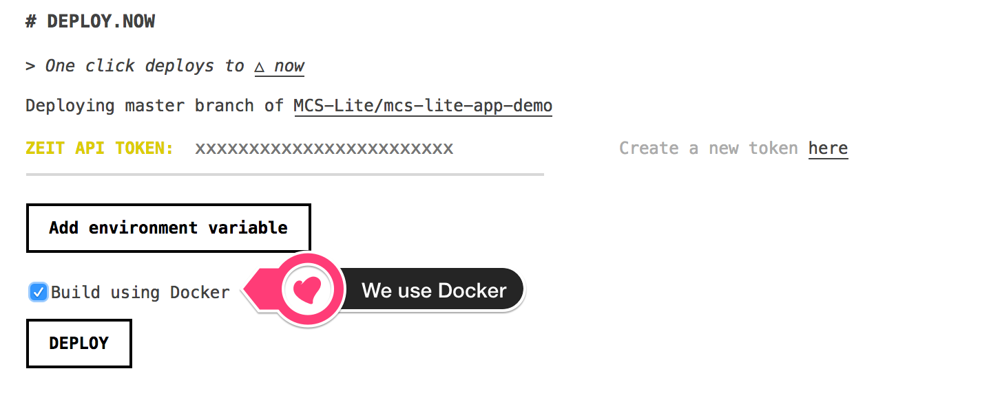
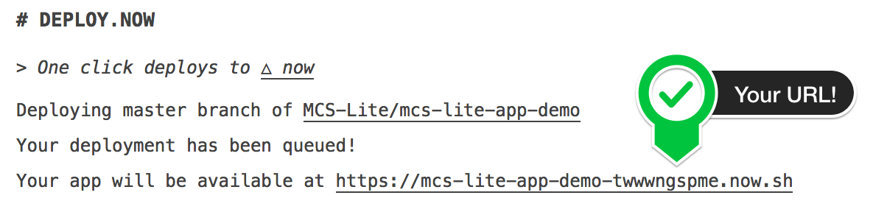
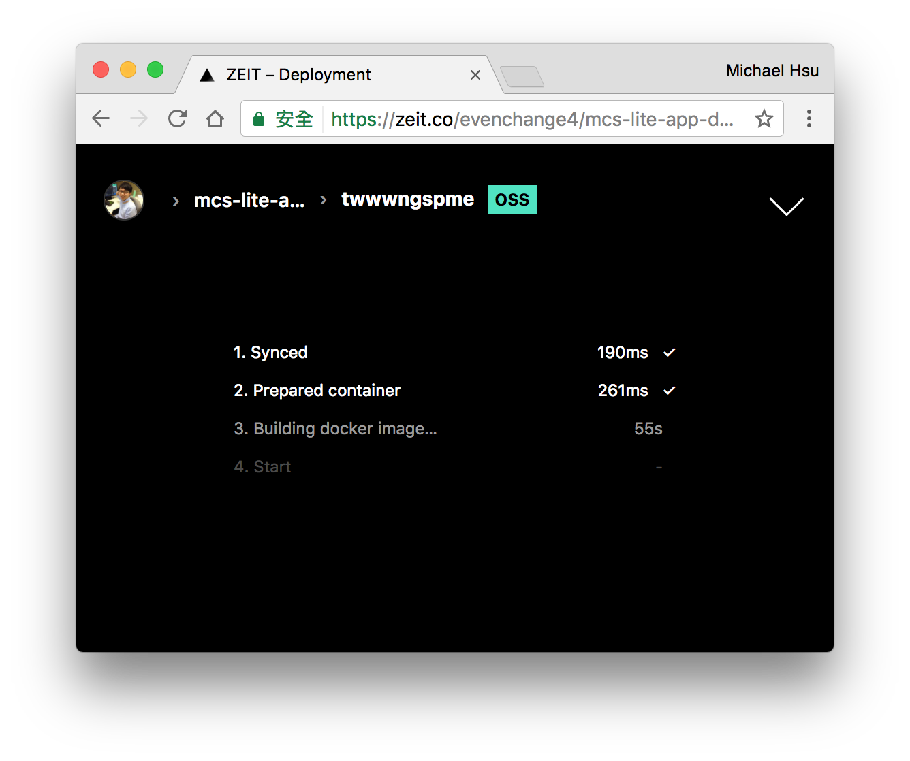

# mcs-lite-app-demo [](https://travis-ci.org/MCS-Lite/mcs-lite-app-demo) [![Github Tag][githubTag-badge]][githubTag] [][dockerhub] [][dockerhub] [](https://greenkeeper.io/)

> Quick demo for mcs-lite-app: [mcs-lite-app.now.sh](https://mcs-lite-app.now.sh)

> Note: For demonstration purposes **ONLY**. The websocket feature do not work on now.sh.

## Deploy to Now.sh

> One click deploys to △ now

[](https://deploy.now.sh/?repo=https://github.com/MCS-Lite/mcs-lite-app-demo&docker=true)


| **Step 1** | **Step 2** | **Step 3** |  **Step 4** |
|-----|-----|-----|-----|
|Click button |Add token and use Docker| Get your Url | Building |
|  |  |  |  |


----

## Docker Support

#### Step 1: Build docker image

You can clone this reporitory and build the docker image locally:

```
$ git clone https://github.com/MCS-Lite/mcs-lite-app-demo.git
$ docker build -t mcslite/mcs-lite-app .
```

Or, directly pull the image from [Dockerhub](https://hub.docker.com/r/mcslite/mcs-lite-app/):

```
# Latest
$ docker pull mcslite/mcs-lite-app:latest

# Or, specific version tag
$ docker pull mcslite/mcs-lite-app:1.0.7
```

#### Step 2: Run

```
$ docker run --rm -it -p 3000:3000 -p 8000:8000 mcslite/mcs-lite-app:1.0.7
```

#### Step 3: \[Option\] Push new images to the Dockerhub

```
# Recommend to use AUTOMATED BUILD
git tag 1.0.x
git push

# Manually
$ docker push mcslite/mcs-lite-app
```

## Deploy to Now.sh Manually

```
# Step 1: Deploy
$ now

# Step 2: Setup alias
$ now alias ls
$ now alias

# Step 3: Remove old deploy
$ now ls
$ now rm [url]

# Step 4: [option] scale
$ now scale mcs-lite-app.now.sh 1
```

## Requirements

-   node >= 8.2.1
-   npm >= 5.3.0
-   yarn >= 0.27.5


[githubTag-badge]: https://img.shields.io/github/tag/MCS-Lite/mcs-lite-app-demo.svg?style=flat-square
[githubTag]: https://github.com/MCS-Lite/mcs-lite-app-demo/releases
[dockerhub]: https://hub.docker.com/r/mcslite/mcs-lite-app/
